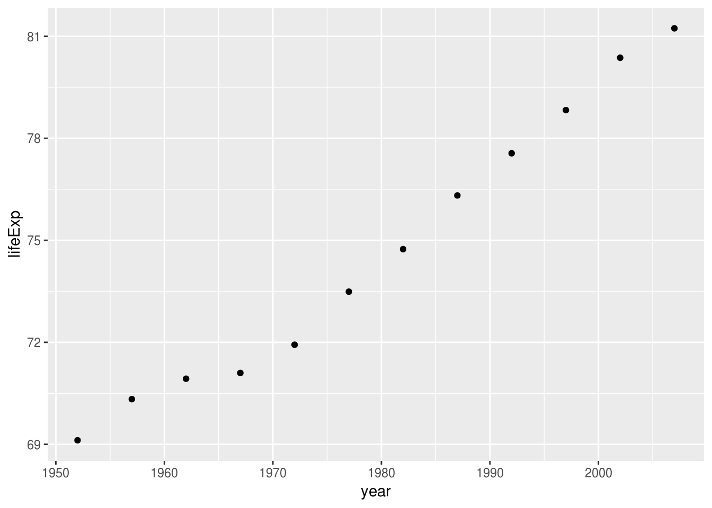

# Citing Figures, Tables & Sections {#start}

When you're writing a report, you often refer to a table or figure in text. 


> Australia's life expectancy has increased a great deal over the past 50 years (Figure 1)



_Figure 1. Life expectancy from 1952 - 2007 for Australia. Life expentancy increases steadily except from 1962 to 1969. We can safely say that our life expectancy is higher than it has ever been!_

And sure, this is figure 1. But what happens if actually, that figure should be moved later in the paper? You need to do the following:

1. Update the reference to figure 1 in the text. 
1. Update the figure 1 caption to not say figure 1.

This is fine. 

Once. 

But it is never once. After this, it is frustrating, and error prone.

There is a way to solve this, which this lesson discusses.

## Overview

* **Teaching** 10 minutes
* **Exercises** 15 minutes

## Questions

* How do I refer to the table or figure in text and link to it?

## Objectives

* Link to tables or figures in text.

## How to refer to tables and figures in text? {.demo}

In order to use this referencing style, you must use the following in the YAML

```
output:
  bookdown::pdf_document2
```

Or for HTML:

```
output:
  bookdown::html_document2
```

Or for word:

```
output:
  bookdown::word_document2
```

This is a new version of document that supports a better way to reference things in text. This reads as:

> Make the output the HTML/PDF/Word document from the bookdown package.

That is, the special `::` after `bookdown`, `bookdown::html_document2` read as "The html_document2 function from the bookdown package".

## Your Turn {.exercise}

1. Convert your output to use `bookdown::html_document2` in your YAML.

## Referencing a figure

To refer to a figure, you write the following in your text:

`Figure \@ref(fig:chunk-name))`

### Demo {.demo}

````markdown
``{r gg-oz-plot, fig.cap = "Life expectancy from 1952 - 2007 for Australia. Life expentancy increases steadily except from 1962 to 1969. We can safely say that our life expectancy is higher than it has ever been!"}
library(ggplot2)
library(dplyr)
gapminder %>%
  filter(country == "Australia") %>%
  ggplot(aes(x = year,
             y = lifeExp)) + 
  geom_point()
```

Australia's life expectancy has increased a great deal over the past 50 years

(See Figure \@ref(fig:gg-oz-plot))

````


```r
library(ggplot2)
library(dplyr)
gapminder %>%
  filter(country == "Australia") %>%
  ggplot(aes(x = year,
             y = lifeExp)) + 
  geom_point()
```

<div class="figure">

<p class="caption">(\#fig:gg-oz-plot)Life expectancy from 1952 - 2007 for Australia. Life expentancy increases steadily except from 1962 to 1969. We can safely say that our life expectancy is higher than it has ever been!</p>
</div>

Australia's life expectancy has increased a great deal over the past 50 years (See Figure \@ref(fig:gg-oz-plot))

### Your Turn {.exercise}

1. Add a new plot in your document and reference it

## Referencing a table

To cite a table, you write the following:

`Table \@ref(tab:chunk-name))`

````markdown
``{r gg-oz-tab}
gapminder %>%
  filter(country == "Australia") %>%
  knitr::kable(caption = "Raw gapminder data for Australia.")
```
````

We can see below in Table \@ref(tab:gg-oz-tab) the raw data used to create Figure \@ref(fig:gg-oz-plot)).


```r
gapminder %>%
  filter(country == "Australia") %>%
  knitr::kable(caption = "Raw gapminder data for Australia.")
```


Table: (\#tab:gg-oz-tab)Raw gapminder data for Australia.

country     continent    year   lifeExp        pop   gdpPercap
----------  ----------  -----  --------  ---------  ----------
Australia   Oceania      1952    69.120    8691212    10039.60
Australia   Oceania      1957    70.330    9712569    10949.65
Australia   Oceania      1962    70.930   10794968    12217.23
Australia   Oceania      1967    71.100   11872264    14526.12
Australia   Oceania      1972    71.930   13177000    16788.63
Australia   Oceania      1977    73.490   14074100    18334.20
Australia   Oceania      1982    74.740   15184200    19477.01
Australia   Oceania      1987    76.320   16257249    21888.89
Australia   Oceania      1992    77.560   17481977    23424.77
Australia   Oceania      1997    78.830   18565243    26997.94
Australia   Oceania      2002    80.370   19546792    30687.75
Australia   Oceania      2007    81.235   20434176    34435.37

### Your Turn {.exercise}

1. Create a table in your document and refer to it in text

## Referencing a section

You can even reference a section in your report:

`\@ref(slug))`

However, in order to write this, you need to include `slug` in your markdown header, like so:

```
## your amazing header {#slug}
```

For example, I can refer to the first section (Section \@ref(start)) in this document by referring to the section as 

`\@ref(start)`

because it was written as:

```
# Citing Figures, Tables & Sections {#start}
```

### Your Turn {.exercise}

1. Reference a section in the report.

## One small note

If you are using a template of some kind, such as those in `rticles`, and want the full featured citation features, then your YAML will need to include something like this:

```yaml
output:
  bookdown::pdf_book:
    base_format: rticles::plos_article
```


