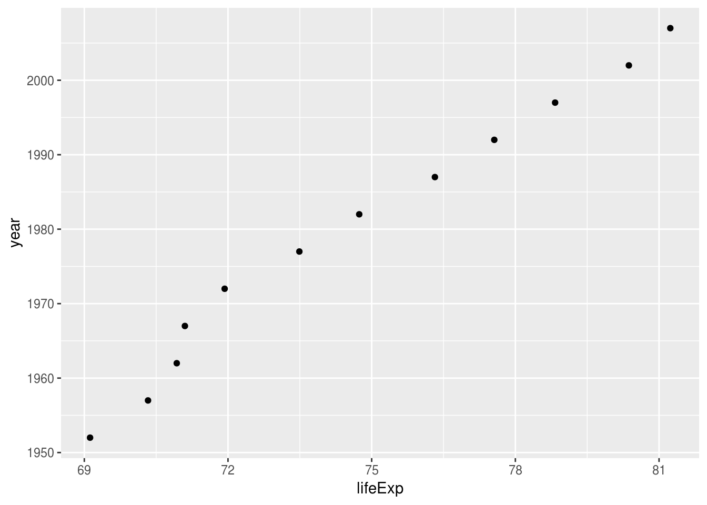

# Figures, Tables, Captions.

You need figures and tables in your own writing, whether it be a journal paper, an internal document, or some documentation. In this section, we discuss how to add figures and tables into your rmarkdown document, and how to provide captions for them.

## Overview

* **Teaching** 10 minutes
* **Exercises** 10 minutes

## Questions

* How do I create a figure in rmarkdown?
* How do I create a table in rmarkdown?
* How do I add captions for figures and tables?

## Objectives

## Tables

To produce a table, I recommend you use the `kable` function from the `knitr` package.

### Demo {.demo}

`kable` takes a `data.frame` as input, and outputs the table into a `markdown table`, which will get rendered into the appropriate output format.

For example, let's say we wanted to share the first 6 rows of our gapminder data.


This gives us the following output


```r
top_gap <- head(gapminder)

knitr::kable(top_gap)
```


country       continent    year   lifeExp        pop   gdpPercap
------------  ----------  -----  --------  ---------  ----------
Afghanistan   Asia         1952    28.801    8425333    779.4453
Afghanistan   Asia         1957    30.332    9240934    820.8530
Afghanistan   Asia         1962    31.997   10267083    853.1007
Afghanistan   Asia         1967    34.020   11537966    836.1971
Afghanistan   Asia         1972    36.088   13079460    739.9811
Afghanistan   Asia         1977    38.438   14880372    786.1134

So how does that work? `kable` prints out the following:

```
|country     |continent | year| lifeExp|      pop| gdpPercap|
|:-----------|:---------|----:|-------:|--------:|---------:|
|Afghanistan |Asia      | 1952|  28.801|  8425333|  779.4453|
|Afghanistan |Asia      | 1957|  30.332|  9240934|  820.8530|
|Afghanistan |Asia      | 1962|  31.997| 10267083|  853.1007|
|Afghanistan |Asia      | 1967|  34.020| 11537966|  836.1971|
|Afghanistan |Asia      | 1972|  36.088| 13079460|  739.9811|
|Afghanistan |Asia      | 1977|  38.438| 14880372|  786.1134|
```

And this then gets _rendered_ as a table. This works for HTML, PDF, and word! 

#### Adding captions to a table

Now, say that we wanted to include a caption? We use the `caption` argument.


```r
knitr::kable(top_gap,
             caption = "The first 6 rows of the dataset, gapminder")
```


Table: (\#tab:print-tab-gap-captions)The first 6 rows of the dataset, gapminder

country       continent    year   lifeExp        pop   gdpPercap
------------  ----------  -----  --------  ---------  ----------
Afghanistan   Asia         1952    28.801    8425333    779.4453
Afghanistan   Asia         1957    30.332    9240934    820.8530
Afghanistan   Asia         1962    31.997   10267083    853.1007
Afghanistan   Asia         1967    34.020   11537966    836.1971
Afghanistan   Asia         1972    36.088   13079460    739.9811
Afghanistan   Asia         1977    38.438   14880372    786.1134

Some other useful features of `kable` include setting the rounding number, with the `digits` option.

For example, we could present the first 2 digits of each number like so:


```r
knitr::kable(top_gap,
             caption = "The first 6 rows of the dataset, gapminder",
             digits = 2)
```


Table: (\#tab:print-tab-gap-digits)The first 6 rows of the dataset, gapminder

country       continent    year   lifeExp        pop   gdpPercap
------------  ----------  -----  --------  ---------  ----------
Afghanistan   Asia         1952     28.80    8425333      779.45
Afghanistan   Asia         1957     30.33    9240934      820.85
Afghanistan   Asia         1962     32.00   10267083      853.10
Afghanistan   Asia         1967     34.02   11537966      836.20
Afghanistan   Asia         1972     36.09   13079460      739.98
Afghanistan   Asia         1977     38.44   14880372      786.11

There are other options that you can set in `kable`, but for these options will get you through a large majority of what you need. For more information on what `kable` can provide, see `?knitr::kable`.

There are many different ways to produce tables in R. We have chosen to show `kable` today because kable is minimal, but powerful. If you want to extend `kable` to do more, look at [kableExtra](https://cran.r-project.org/web/packages/kableExtra/index.html), in particular the option `kableExtra::kable_styling(latex_options = c("hold_position"))`.

### Your Turn {.exercise}

1. Create a summary of your gapminder data, and put it into a table.
1. Add a caption to this table
1. Set the number of decimals to 2.

## Figures

Printing figures is probably my favourite feature of rmarkdown. It is actually relatively straightforward in the case of plots. You provide the plot you want to show in a code chunk!

#### Demo {.demo}

For example, I can print a plot of the gapminder data for Australia like so:


```r
library(ggplot2)
```

```
## Registered S3 methods overwritten by 'ggplot2':
##   method         from 
##   [.quosures     rlang
##   c.quosures     rlang
##   print.quosures rlang
```

```r
library(dplyr)
```

```
## 
## Attaching package: 'dplyr'
```

```
## The following objects are masked from 'package:stats':
## 
##     filter, lag
```

```
## The following objects are masked from 'package:base':
## 
##     intersect, setdiff, setequal, union
```

```r
gapminder %>%
  filter(country == "Australia") %>%
  ggplot(aes(x = year,
             y = lifeExp)) + 
  geom_point()
```


### Captions for figures {.demo}

Inserting a caption for a figure is a little bit different. The caption argument is controlled in the chunk option, under the option, `fig.cap`.

So to insert a figure, we do the following.

````markdown
``{r gg-oz-gapminder, fig.cap = "Life expectancy from 1952 - 2007 for Australia. Life expentancy increases steadily except from 1962 to 1969. We can safely say that our life expectancy is higher than it has ever been!"}
library(ggplot2)
library(dplyr)

gapminder %>%
  filter(country == "Australia") %>%
  ggplot(aes(x = lifeExp,
             y = year)) + 
  geom_point()
```
````

Which would produce the following output


```r
library(ggplot2)
library(dplyr)

gapminder %>%
  filter(country == "Australia") %>%
  ggplot(aes(x = lifeExp,
             y = year)) + 
  geom_point()
```

<div class="figure">

<p class="caption">(\#fig:gg-oz-gapminder)Life expectancy from 1952 - 2007 for Australia. Life expentancy increases steadily except from 1962 to 1969. We can safely say that our life expectancy is higher than it has ever been!</p>
</div>

### Your Turn {.exercise}

* Create a plot with your .Rmd doc
* Add a figure caption

### Inserting images

We cannot always generate the graphics that we want - for example, we might have an image of something that we want to show, or perhaps a nice flowchart someone else made.

In our case, say we wanted to insert the new SSA logo into our document, there are two ways we can do this.

1. With `markdown` syntax
1. with `knitr::include_graphics()`

**Markdown syntax**

The markdown syntax to insert an image is: ``

#### Demo {.demo}

So we could insert the new SSA vic logo by doing the following:

````markdown
```

```
````

Which would give us the following output:


But say that we want more control over the output, like we want to center the image, and we want to make it smaller? Then you can use `knitr::include_graphics()`, and control the figure size using the options `out.width`, and add a caption with `fig.cap`.

````markdown
``{r ssa-logo, fig.align = 'center', out.width = "25%", fig.cap = "The new SSA logo, which is actually a scatterplot, which is super neat!"}
knitr::include_graphics(here::here("figs", "ssa-logo.png"))
```
````


```r
knitr::include_graphics(here::here("figs", "ssa-logo.png"))
```

<div class="figure" style="text-align: center">

<p class="caption">(\#fig:ssa-logo)The new SSA logo, which is actually a scatterplot, which is super neat!</p>
</div>

`

### Your Turn {.exercise}

1. Download [the gapminder logo](https://www.gapminder.org/wp-content/themes/gapminder/images/logo.png) and put it into a new directory call "figs"
1. Insert this image into your rmarkdown document around where you introduce gapminder.

## Summary

We've now learned how to insert tables, plots, and images into our documents!

<!-- - `pander` -->
<!-- - `xtable` -->
<!-- - `kableExtra` -->
<!-- - the list goes on! -->
<!-- - https://github.com/ropenscilabs/packagemetrics -->
<!-- - https://ropensci.org/blog/blog/2017/06/27/packagemetrics -->
