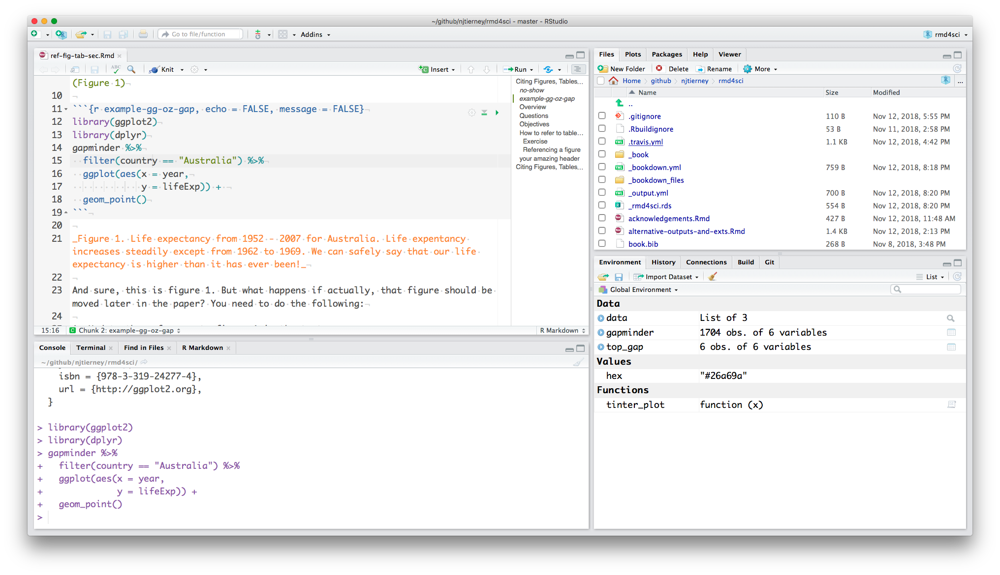
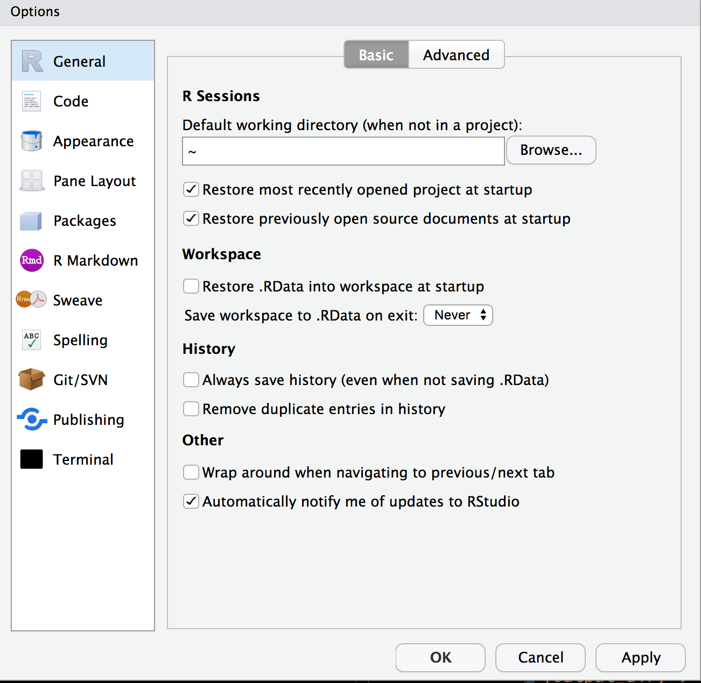

# RStudio, What and Why

## Overview

* **Teaching** 5 minutes
* **Exercises** 2 minutes

## Questions

* What is RStudio?
* Why should I use RStudio?
* What features should I change?

## Objectives

* Get familiarised with RStudio
* Get set up with not storing the RStudio workspace
* Download the course materials for the workshop

## What is RStudio, and why should I use it?

If R is the engine and bare bones of your car, then RStudio is like _the rest of the car_. The engine is super critical part of your car. But in order to make things properly functional, you need to have a steering wheel, comfy seats, a radio, rear and side view mirrors, storage, and seatbelts. 

The RStudio layout has the following features:

- On the upper left, the Rmarkdown script
- On the lower left, the R console
- On the lower right, the view for files, plots, packages, help, and viewer.
- On the upper right, the environment / history pane


```{r rstudio-screenshot, echo = FALSE, fig.cap = "A screenshot of the RStudio working environment."}

```

We saw a bit of what an rmarkdown script does.

The R console is the bit where you can run your code. This is where the R code in your rmarkdown document gets sent to run. 

The file/plot/pkg viewer is a handy browser for your current files, like Finder, or File Explorer, plots are where your plots appear, you can view packages, see the help files.
And the environment / history pane contains the list of things you have created, and the past commands that you have run.

## Exercise: RStudio default options {.exercise}

To first get set up, I highly recommend changing the following setting

Tools > Global Options (or `Cmd + ,` on macOS)

Under the **General** tab:

- For **workspace**
    - Uncheck restore .RData into workspace at startup
    - Save workspace to .RData on exit : "Never"
- For **History**
    - Uncheck "Always save history (even when not saving .RData)
    - Uncheck "Remove duplicate entries in history"

```{r fig-rstudio-workspace-options, fig.cap = "Setting the options right for RStudio, so you don't restore previous sessions work, and don't save it either.", out.width = "50%", echo = FALSE}

```

This means that you won't save the objects and other things that you create in your R session and reload them. This is important for two reasons

1. **Reproducibility**: you don't want to have objects from last week cluttering your session
2. **Privacy**: you don't want to save private data or other things to your session. You only want to read these in.

Your "history" is the commands that you have entered into R.

Additionally, not saving your history means that you won't be relying on things that you typed in the last session, which is a good habit to get into!

## Learning more

- [RStudio IDE cheatsheet](https://github.com/rstudio/cheatsheets/raw/master/rstudio-ide.pdf)
