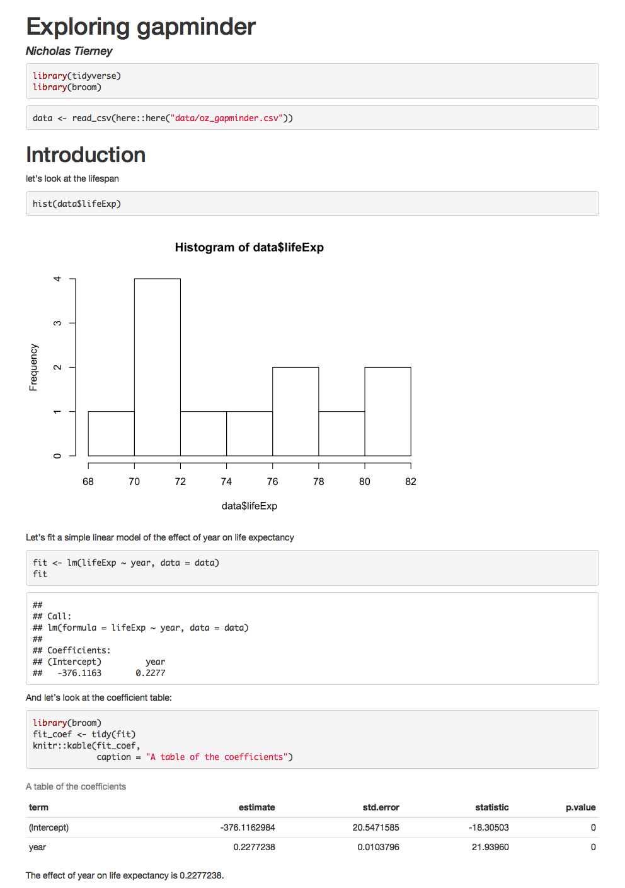

# Why RMarkdown

The goal of this section is to briefly discuss why we want to learn rmarkdown, the benefits, and the barriers to using it.

## Overview

* **Teaching** 3 minutes
* **Exercises** 5 minutes

## Questions

* What is the value in a reproducible report?
* What is markdown?
* Can I combine my software and my writing?

## Objectives

* [Learn how to use markdown](https://www.markdowntutorial.com/)
* Think about why you want to use markdown

## Your Turn {.exercise}

1. **Why are we here** Form small groups of 2-4 with your neighbours and discuss how you expect learning rmarkdown might benefit you.

## Reproducibility is a problem

We are in a crisis at the moment where a lot of people cannot reproduce scientific work. This isn't just a few people, and it's not cheap. Estimates say that in the biomedical industry, in the USA, irreproducibility (not being able to reproduce a given piece of work) costs $28 Billion dollars annually [^1]. That's one country, one field, and one year.

[^1]:The article, [Freedman, 2010](https://journals.plos.org/plosbiology/article?id=10.1371/journal.pbio.1002165), Heard via Garret Grolemund's [great talk](https://www.youtube.com/watch?v=HVlwNayog-k)

So what can we do about it?

## Literate programming is a partial solution

The idea of literate programming shines some light on this dark area of science. This is an idea from [Donald Knuth](https://en.wikipedia.org/wiki/Donald_Knuth) where you combine your text with your code output to create a document. This is a _blend_ of your literature (**text**), and your programming (**code**), to create something that you can read from top to bottom. Imagine your paper - the introduction, methods, results, discussion, and conclusion, and all the bits of code that make each section. With rmarkdown, you can see all the pieces of your data analysis all together.

#### Some history {.history}

This was a popular idea, and it has had some interesting discussion and contributions over the years. Notably, in the R ecosystem, the _Sweave_ (S+weave) program provided a way to write text and code together. As with any technology, there were some speedbumps with using Sweave, and some of the reasons we are not teaching it now is because:

* It uses a form of LaTeX, which provides great flexibility at the cost of complexity.
* Printing figures involves additional work
* There isn't a way to save (cache) your work. Every analysis has to be repeated from start to finish. This was time consuming.

## Markdown as a new player to legibility

In 2004, [John Gruber](https://en.wikipedia.org/wiki/John_Gruber), of [daring fireball](https://daringfireball.net/) created a [markdown](https://en.wikipedia.org/wiki/Markdown), a simple way to create text that rendered into a HTML webpage.

### A brief example of markdown

For example,

```markdown
- bullet list
- bullet list
- bullet list

1. numbered list
2. numbered list
3. numbered list

__bold__, **bold**, _italic_, *italic*

> quote of something profound
```

````
```r
# computer code goes in three back ticks
1 + 1
2 + 2
```
````

Would be converted to:


- bullet list
- bullet list
- bullet list

1. numbered list
2. numbered list
3. numbered list

__bold__, **bold**, _italic_, *italic*

> quote of something profound


```r
# computer code goes in three back ticks
1 + 1
```

```
## [1] 2
```

```r
2 + 2
```

```
## [1] 4
```

With very little marking up, we can create rich text, that **actually resembles** the text that we want to see.

Some other nice features of markdown include:

|  thing          | markdown      | rendered     |
|----------------:|--------------:|:-------------|
|  superscript    |  `2^nd^`      | 2^nd^        |
|  subscript      |  `CO~2~`      | CO~2~        |
|  strikethrough  |  `~~mistake~~`| ~~mistake~~  |
| links           | `[text](http:://www.example.com/your-link-goes-here)`| [text](http:://www.example.com/your-link-goes-here) |
| images          | `` | ``|

<!-- | footnote(s)     | `[^4]` followed by `[^4]: footnote text goes here`.| [^4] followed by [^4]: footnote text goes here. | -->

## Your Turn {.exercise}

1. **Learn to use markdown** In your small groups, spend five minutes working through this [brief online markdown tutorial](https://www.markdowntutorial.com/)

## Rmarkdown helps complete the solution to the reproducibility problem

So, how do we combine this with our R code, into a literate programming environment?

`Rmarkdown` provides an environment where you can write your complete analysis, and marries your text, and code together into a rich document. You write your code as code chunks, put your text around that, and then hey presto, you have a document you can reproduce.

For example, look at the following report:



How did we generate it?


```yaml
---
title: "Exploring gapminder"
author: "Nicholas Tierney"
output: html_document
---
```

````

```{r library, message = FALSE}
library(tidyverse)
library(broom)
```

``{r data-read-in, message = FALSE}
data <- read_csv(here::here("data/oz_gapminder.csv"))
```

# Introduction

let's look at the lifespan

``{r hist-life-exp}
hist(data$lifeExp)
```

Let's fit a simple linear model of the effect of year on life expectancy

``{r example-lm}
fit <- lm(lifeExp ~ year, data = data)
fit
```

And let's look at the coefficient table:

``{r coef-table}
library(broom)
fit_coef <- tidy(fit)
knitr::kable(fit_coef,
             caption = "A table of the coefficients")
```

The effect of year on life expectancy is `r fit_coef$estimate[2]`.
````

We _render_ this code and it creates this report!

It has a plot, it has a table, we even refer to some of the values in the text - the last line of the report looks at the effect of year.

But what if the data changes? At the moment we are looking at only Australia - say we get the full dataset, what happens then?

Say you'd created your report by hand in microsoft word, and with a graphical user interface software.

You would need to:

1. Go back to the GUI, re run the analysis
1. Import the results into excel
1. Create your graph
1. copy the graph into word
1. copy the results of the coefficients into the text
1. copy the results of the coefficient table into the text.

This is painful.

And what if someone wants to know _exactly_ how you did your analysis?

This process isn't exactly sharable.

But if you did it in rmarkdown?

Just update the data, and render the document again, and get an updated document:


The results are different!

And we just pointed it to some different data. Then re-rendered it.

That's it.

That is why we use rmarkdown.

## Summary

In this section we've learned about:

- What the value is in a reproducible report
- What is markdown
- How to combine software and writing
- How to use markdown

## Learning more

- [rstudio's rmarkdown cheatsheet](https://github.com/rstudio/cheatsheets/raw/master/rmarkdown-2.0.pdf)

- [Bookdown's section on markdown syntax](https://bookdown.org/yihui/bookdown/markdown-syntax.html)
